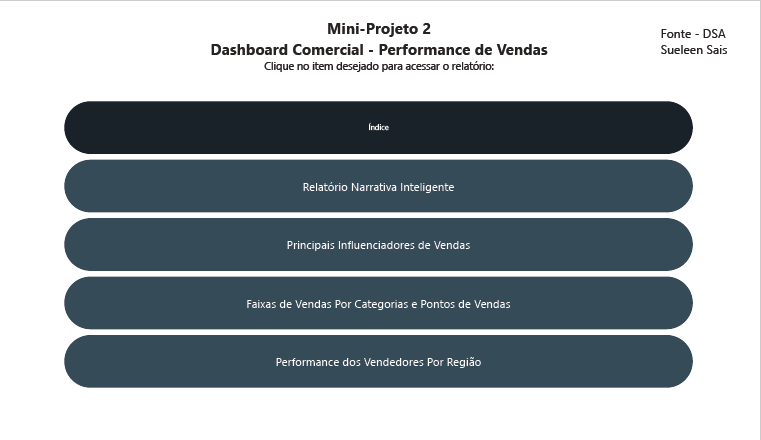
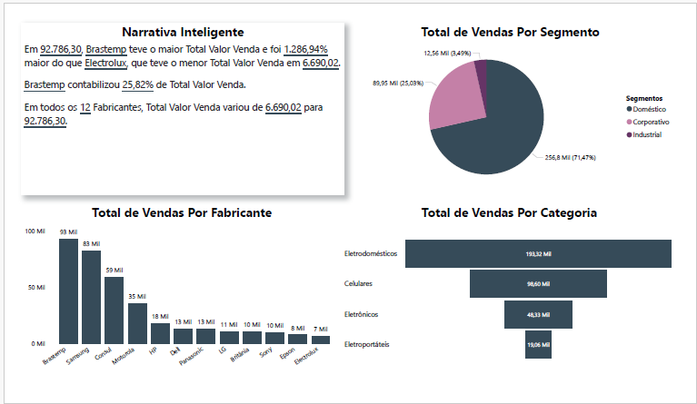
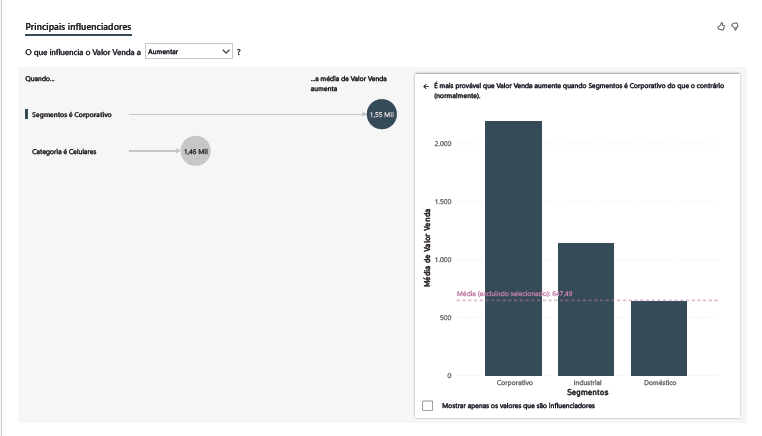
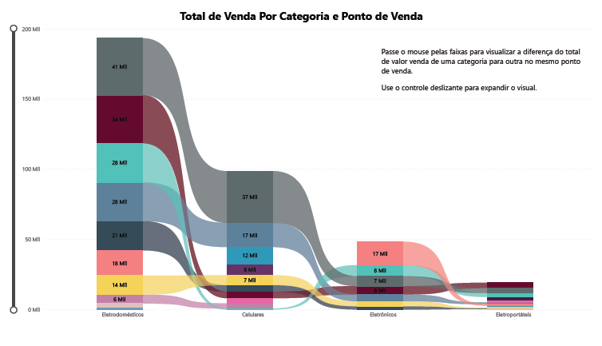
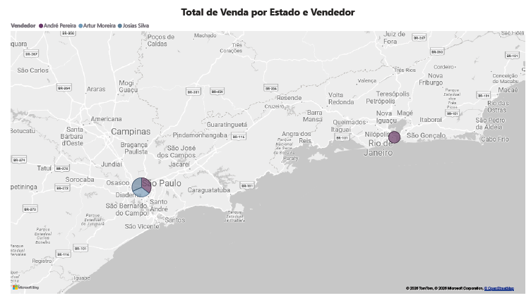

📊 **Mini-Projeto 2 – Dashboard Comercial: Performance de Vendas**

📌 *Introdução*

Este projeto foi desenvolvido durante o capítulo 5 do curso "Microsoft Power BI para Business Intelligence e Data Science" da Data Science Academy.  
O objetivo é aplicar conceitos de análise de dados comerciais utilizando Power BI, explorando diferentes recursos visuais e narrativos para compreender a performance de vendas de uma empresa fictícia.

Os dados utilizados são fictícios e fornecidos pela Data Science Academy.
  
O projeto simula um cenário de negócio real, permitindo a prática de análises, correção de dados, cálculo de métricas e extração de insights para apoiar decisões estratégicas na área comercial.

🎯 *Objetivos*

- Criar dashboards interativos para análise comercial.  
- Explorar recursos do Power BI como:
  - Narrativa Inteligente  
  - Principais Influenciadores  
  - Gráfico de Faixas  
  - Criação de menu para índice do Dashboard  

🛠️ *Tecnologias Utilizadas*

- Power BI Desktop
- Recursos de visualização e storytelling de dados 
- Power Query para transformação e limpeza dos dados   

📂 *Estrutura do Dashboard*

O projeto contém quatro principais relatórios:

1. Narrativa Inteligente 
2. Principais Influenciadores de Vendas 
3. Faixas de Vendas por Categorias e Pontos de Vendas  
4. Performance dos Vendedores por Região 

Cada relatório busca compreender variáveis relevantes, criar gráficos e medidas, extrair métricas e cruzar dados, com o objetivo de entregar aos tomadores de decisão uma visão completa sobre:

- O segmento, categoria e fabricante que mais vendem 
- Os principais influenciadores de vendas 
- As categorias que mais vendem em um determinado ponto de venda
- A performance dos vendedores

🔎 *Principais Insights*

1. Vendas por Fabricante
- Brastemp lidera com R$ 92.786,30, representando 25,82% do total.  
- Electrolux teve o menor valor de vendas (R$ 6.690,02).  
- A diferença entre o maior e menor fabricante é de mais de 1.200%.

2. Vendas por Segmento
- Industrial domina com 71,47% do total de vendas.  
- Corporativo representa 25,03%, enquanto o Doméstico apenas 3,49%.

3. Vendas por Categoria
- Eletrodomésticos são a categoria mais vendida (R$ 193,32 mil).  
- Em seguida vêm Celulares (R$ 98,60 mil) e Eletrônicos (R$ 48,33 mil).  
- Eletroportáteis têm menor participação (R$ 19,06 mil).

4. Principais Influenciadores
- O segmento Corporativo aumenta significativamente o valor médio de vendas.  
- A categoria Celulares também aparece como fator relevante para crescimento. 

5. Performance Regional
- O dashboard mostra a distribuição de vendas acima de R$ 30.000,00 por estado e vendedor, permitindo identificar regiões mais fortes e vendedores com melhor desempenho.  

🚀 *Conclusão*

Este mini-projeto foi uma introdução prática ao uso do Power BI para análises comerciais.  
Mesmo com dados fictícios, foi possível compreender como diferentes dimensões (fabricante, segmento, categoria e região) influenciam a performance de vendas.  

📊 *Exemplos de Visualizações*

📌 *Como visualizar*

1. Baixe o arquivo `.pbix` disponível neste repositório  
2. Abra no Power BI Desktop para explorar os relatórios  
3. Utilize os índice selecionando a tecla ctrl + clique para navegar pelas diferentes páginas

